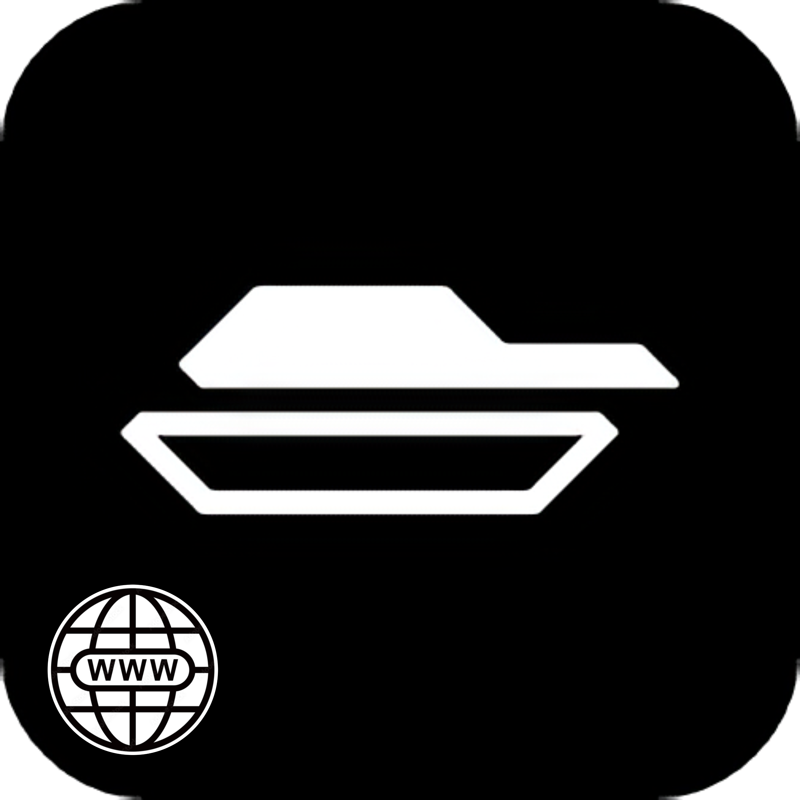

  

<h1 align="center">
  Каталог військової техніки
</h1>

<h3 align="center">Завантажити</h3>

<h2 align="center">
   Про додаток
</h2>

Каталог військової техніки - це додаток, який містить опис і загальні характеристики різних одиниць ворожої техніки.
Його призначення - допомогти українцям якнайшвидше її ідентифікувати та повідомляти про її пересування нашим військовим.

**_Як працює додаток:_**

Якщо ви стали свідком пересування ворожої техніки на території України, ви можете одразу знайти її в каталозі, ознайомитись із загальними даними про неї та повідомити ЗСУ її клас і місцезнаходження за допомогою офіційного телеграм-бота Міністерства цифрової трансформації України <a href="https://t.me/evorog_bot">єВорог</a>

**_Про безпеку:_**

1. Додаток **не** відслідковує вашу геолокацію.
   Ми дбаємо про вашу безпеку та безпеку ваших даних. Код додатку є загальнодоступним. Ви можете переконатися, що він не взаємодіє з даними Вашого пристрою, зокрема з геолокацією. Ми використовуємо лише перевірені посилання на ресурси.
2. Усі зовнішні посилання, які містяться в додатку, ведуть виключно на надійні ресурси, як-от Вікіпедія, телеграм-бот і YouTube. Усі ресурси є у вільному доступі й за бажанням можуть бути знайдені та переглянуті самостійно.

Додаток знаходиться в активній розробці та постійно доповнюється новою інформацією та додатковими можливостями.

<h4>
  <a href="./CONTRIBUTION.md">
    Інструкції для модераторів контенту
  </a>
</h4>

<h4 align="left"> 
  Зворотний звʼязок
</h4>

example@domen.com